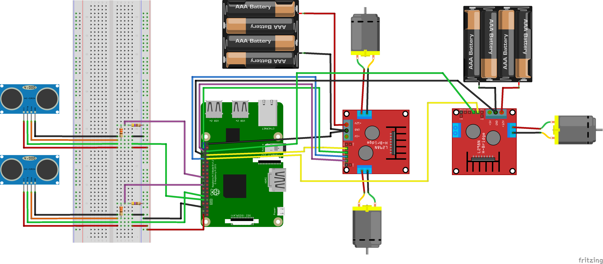

# Mochobot

# Tabla de contenidos

* [¿Qué es?](#qué-es)
* [Requerimientos](#requerimientos)
* [Como utilizar](#cómo-utilizar)
* [Descripción del Robot](#descripción-del-robot)
* [Componentes Electrónicos](#componentes-electrónicos)
* [Piezas 3D](#piezas-3d)
* [Esquema de Hardware](#esquema-de-hardware)
* [Arquitectura del Software](#arquitectura-del-software)
* [Imágenes](#imágenes)
* [Bibliografia](#bibliografia)
* [Autores](#autores)

# ¿Qué es?

Mochobot es un robot de limpieza inteligente capaz de identificar manchas en diferentes superficies y eliminarlas.

# Requerimientos

Para la ejecución del codigo del repositorio:
* [Python 3.9.x](https://www.python.org/)
* [NumPy](https://numpy.org/)
* [Rpi.GPIO](https://pypi.org/project/RPi.GPIO/)
* [Opencv](https://opencv.org)

# Cómo utilizar

1. Clonar el repositorio.
    > git clone https://github.com/kikegb/mochobot.git

2. Instalar las librerías requeridas:
    > pip install -r src/requirements.txt

3. Ejecutar main.py.

# Descripción del Robot

Mochobot ha sido diseñado con el objetivo de moverse de forma autónoma por un espacio evitando obstáculos utilizando sus 2 sensores de ultrasonidos y detectar manchas para seguidamente utilizar su dispositivo de limpieza para eliminarlas.

# Componentes Electrónicos

* Raspberry Pi 3 B+
* Micro bomba de agua con tubo
* Cámara PC - 8 Megapixels
* Motores DC x 3
* Sensor ultrasonidos HC-SR04
* Controladoras de motor L298N x 2
* Portapilas 4 AAA x 2
* Placa protoboard 400 puntos

# Piezas 3D

Las piezas 3D utilizadas pueden accederse [aqui](https://github.com/kikegb/mochobot/tree/main/3D).

# Esquema de Hardware

# Arquitectura del Software

# Imágenes

# Bibliografia

* [Robot esquiva obstáculos con Arduino y un sensor de ultrasonidos.](https://eloctavobit.com/arduino/robot-esquiva-obstaculos-con-arduino-sensor-ultrasonidos/)
* [Robot limpiador de pisos que evita obstáculos.](https://www.youtube.com/watch?v=109XJldAMss)

# Autores

* [Alex Navarro](https://github.com/AlecitoUAB)
* [Evelyn Ramírez](https://github.com/1569037)
* [Enrique Gómez](https://github.com/kikegb)
* [Abel Blanco](https://github.com/abprous)
* [Jordi Vila](https://github.com/jvfjordiv)
